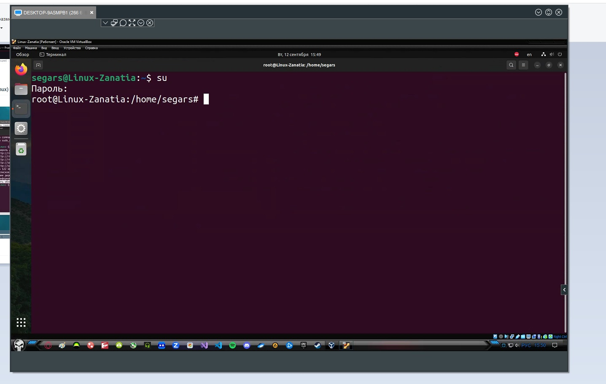

# Linux

 

  Установка системы Linux на виртуалку. 

* Программы необходимые для установки
    1. ### VirtualBox - [Скачать](https://www.virtualbox.org/wiki/Downloads) 
    ###
    2. ### Образ системы Linux [Скачать](https://ubuntu.com/download/desktop) 
    ###
    3. ### Запускаем программу VirtualBox, далее нажимаем создать (зелённая надпись сверху), после этого нажимаем режим эксперта. 
    ###
    4. ### Настраиваем имя образа, путь где будет установлен и храниться и сам образ который мы скачали, ну и систему которую хотим установить.
    ###
    5. ### Далее в следущей вкладке, настраиваем имя пользователя на вход в систему.  
    ###
    6. ### Вследующей вкладке, выделяем ресурсы под систему (это не постоянное выделение, а в момент, когда будем запускать и рабоать в системе)
    ###
    7. ### В следующей вкладке (Жёский диск, просто выделяем места под систему, примерно если не жало выделить 50гигов) Затем нажать готов, пойдёт установка системы.
    8. ### После установки, в программе VirtualBox уже нажимаем запуск системы.
    ###
    9. ### После того как поработали в системе, закрываем на крестик, и выбираем выключение по середине.

    

 

  Непосредственная работа в системе Linux.

* Вся работа в системе Linux практически осуществляеться через терминал.
* Запустив терминал, зачастую многие команды требуют пароль root или по другому администратора.
    * Для этого в терминале необходимо прописать комаду su, далее запросит пароль администратора, его ввести (пароль не видно что вводим), после этого покажет что мы уже не пользователь а администратор (root)
    
    * 24124wf

