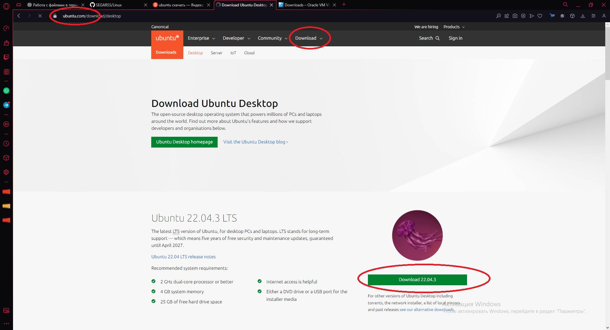
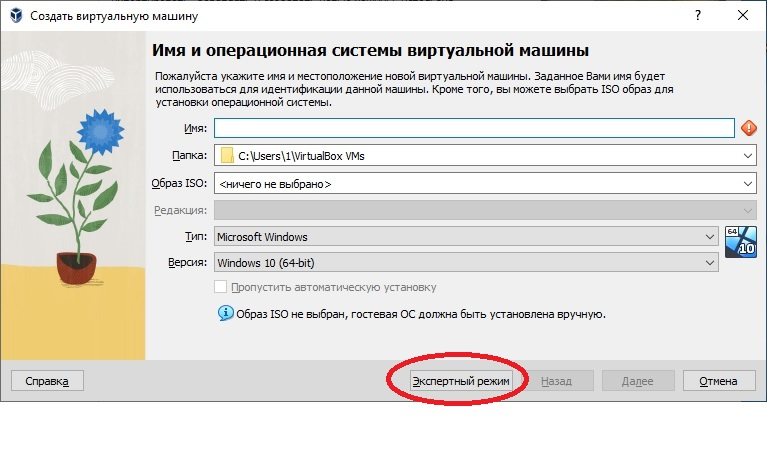
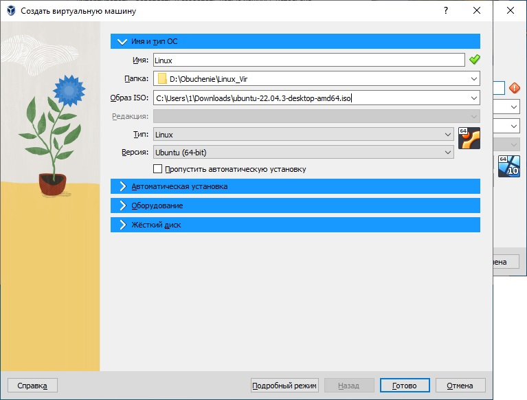
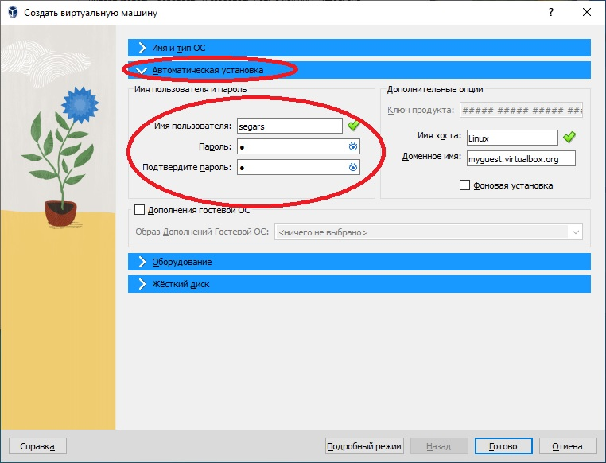
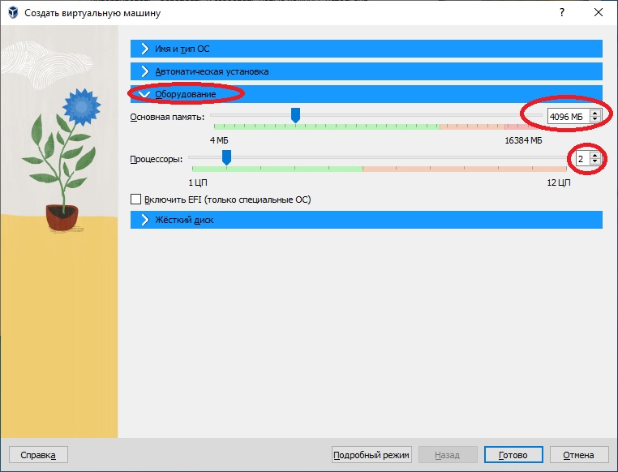
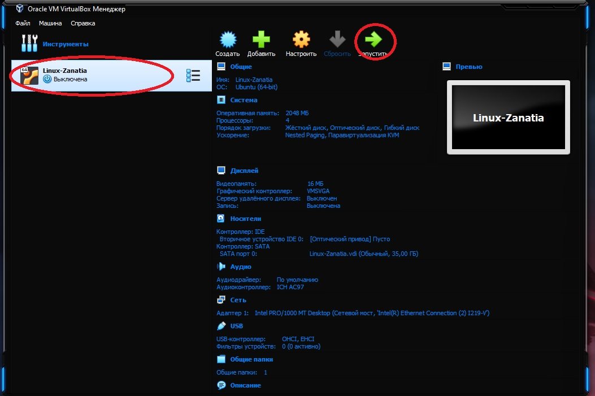
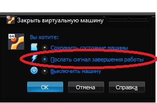
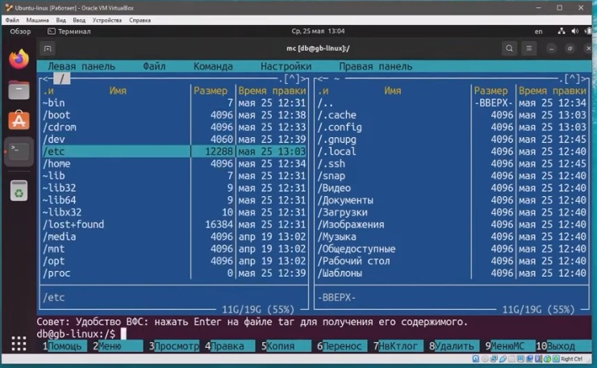
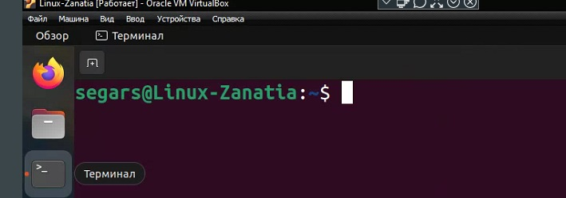

# Linux

 

  Установка системы Linux на виртуалку. 

* Программы необходимые для установки

1. ### VirtualBox - [Скачать](https://www.virtualbox.org/wiki/Downloads) 
###

2. ### Образ системы Linux [Скачать](https://ubuntu.com/download/desktop) 
###
3. ### Запускаем программу VirtualBox, далее нажимаем создать (зелённая надпись сверху), после этого нажимаем режим эксперта. 
###
4. ### Настраиваем имя образа, путь где будет установлен и храниться и сам образ который мы скачали, ну и систему которую хотим установить.
###
5. ### Далее в следущей вкладке, настраиваем имя пользователя на вход в систему.  
###
6. ### Вследующей вкладке, выделяем ресурсы под систему (это не постоянное выделение, а в момент, когда будем запускать и рабоать в системе)
###
7. ### В следующей вкладке (Жёский диск, просто выделяем места под систему, примерно если не жало выделить 50гигов) Затем нажать готов, пойдёт установка системы.
8. ### После установки, в программе VirtualBox уже нажимаем запуск системы.
###
9. ### После того как поработали в системе, закрываем на крестик, и выбираем выключение по середине.

 

  Непосредственная работа в системе Linux.

###

* Вся работа в системе Linux практически осуществляеться через терминал.

###

* Запустив терминал, зачастую многие команды требуют пароль root или по другому администратора.
    * Для этого в терминале необходимо прописать комаду su, далее запросит пароль администратора, его ввести (пароль не видно что вводим), после этого покажет что мы уже не пользователь а администратор (root)
    

###

* Запуск через терминал своего рода тоталкомандер (работа с файлами.). В терминале прописываем команду mc 

###

* Расшифровка
    * segars - имя пользователя
    * Linux-Znatia - имя компа
    * :~$ каталог в котром мы находимся.
    * 

###

* Абсолютный путь к файлу/каталогу, пример cat/var/log/syslog.
* Относительный путь cat test/testfile, cd home
тобижь, слэщь(/) не используеться.
* Редакток текста в терминале (vim). Прописываем команду vim (название файла) и мы его можем редактировать.
    * чтоб начать редактировать, нажимаем кнопку (I)
    * чтобы закончить режим запист, нажимаем (Esc)
    * чтобы сохранить документ и закрыть его, нужно зажать комбинацию Shift+(:) и далее ввести команду wq - выглядеть будет так - :wq 
    После этого файл закроеться и обратно откроеться терминал.
    * чтобы не сохранить изминения которые мы сделали, то после Shift+(:) прописываем q!, и мы закроем файл без сохранения.
* Текстовый редактор nano, запуск также в терминале.
    * Все команды прописанны и видны сразу, все команды идут через Ctrl+
* Текстовый редактор mcedit (он идёт от mc)
    * понятный редактор. На клавиши F1 по F10 всё меня, и вызов дополднительных опций по клавише F9
* Пользователи. Их можно просмотреть через команду cat /etc/passwd и нам выдаст всю информацию о всех имеющихся пользователей в системе.
* Посмотреть группы пользователй cat /etc/group
* Посмотреть пароли пользователей cat /etc/shadow
* Чтобы добавить - создать пользвателя необходимо прописать sudo useradd -s /bin/bash -m -d /home/(имя каталога) (имя пользователя). Таким образом мы указали, группу пользвателя, создали ему домашний каталог.
    * Теперь ему нужно создать пароль, sudo passwd (Имя пользователя), такой командой как назначаеться пароль так и сбрасываеться.
* Ещё способ создать пользователя sudo adduser (имя пользователя), запустить алгоритм создания пользователя, где нас запросят сразу создать ему пароль, вбить дополнительные данные группы, адреса, телефона и так далее.
* Просмотр пользователей в системе ещё одной командой, tail /etc/passwd
* Закинуть пользователя в другую группу. sudo usermod -aG adm (имя пользователя). Мы перекинули пользовтеля в группу админов. После этого, чтобы посмотреть, какие вообще есть группы у пользователя мы прописываем команду id.
* Удалить пользователя sudo userdel (имя  пользователя)
* Команда создать группу для пользователей sudo groupadd (название группы)
* Команда удалить группу для пользователей sudo groupdel (название группы)
* Как переключиться на любого пользователя в системе, прописываем команду su (имя пользователя). Если прописать только su и нажать интер, это поумолчанию запрос на переключение супер пользователя root
* Редактор прав супер пользователей, прописываем sudo visudo, откроеться редактор, где мы можем изминить права и другие политики безопасностей разных пользователей и груп. Данный файл, редактировать опасно, лишний раз лучше там быть внмательней.
* Права на файлы, каталоги можно настроить через mc.

 

  Команды в терминале. 

* Для любой команды, можно запросить подсказку, если мы забыли или не знаем что она может и как её применить.
    * К примеру ls --help получим описания, для чего и что мы можем сделать
    * или man ls тоже своего рода справка по команде
* su - запуск режима администратора
* mc - запуск тотол командора
* Ctrl+L - очистка терминала
* Ctrl+О - свернуть тотол командер (mc)
* Ctrl+Shift+(+) - увеличевает текст в терминале.
* команда cd / (имя каталога куда хотим попасть)
* команда cd - выйдем в корней каталог
* команда exit выйдем из программы или из режима администратора (root)
* команда ip a - покажет адрес айпи
* команда ls -al покажет все файлы в каталоге
* команда cd /dev - устройства
* команда cd /proc - процессы состояния системы ОС
* команда cd /sys - информация о системе
* команда cd /run - временные файлы
* команда pwd - выдаст нам полный путь каталога в котором мы находимся, затем для удобства его скопировать и применить если потребуеться.
* команда mkdir (далее любое название), создас каталог.
* команда mkdir -p может создать множество каталогов (пример - mkdir -p 1/2/3/4/5)
* команда cd ~/ (далее название каталога чтобы сразу перейти)
* команда ll - быстро посмотрит есть ли чтото в данном каталоге или нет.
* команда cat >(название файла), создадим файл, после нажатия ввода, вводим данные которые запишуться на файл, и как только закончили ввод нажимаем комбинацию Ctrl+D это закончит ввод и сохранит в файл всё что мы прописыали.
* команда cat >> (название файла), мы дозаписываем какието данные в файл. Если после команды cat мы поставим один символ (>), то мы затерём новыми данными старые данные в файле.
* команда cd .. мы попадём в каталог на уровень выше, ну или назад.
* команда cp (название файла) (название файла), мы копируем файл с новым названием.
* команда cp -r (название каталога) - может копировать каталоги.
* команда mv (название каталога, файла) (новое название каталога, файла) - переименовываем файл,каталог.
* команда rm (название файла) - удаляет его.
* команда rm -rf (название каталога) - удаляет его. Данная команда, очень опасная, и удаляет файлы и каталог без права на востановления. Чтобы не лохануться, и не удалить то что не нужно или скажем так чтобы не удалить не у такого кого не нужно, надо прописать полный путь удаления, пример - rm -rf /home/segars/test2 - таким образом, мы обезапасим себя, и не перепутаем, что удаляем каталог/файл у того у кого нужно.
* команда touch (название файл) - создаёт просто пустой файл.
* команда cat (название файлв) (название файлв) > (название файлв) склеит два файл в другой новый.
* команда cat (название файлв) покажет что в нутри файла есть.
* команда ln (название файлв) (название файла и в конце дописать приставку_ln), таким образом мы создадим копию файл и при этомо, всё что мы делаем с копией или в копии, отражаеться на оригинал. (понятие жёских ссылок)

